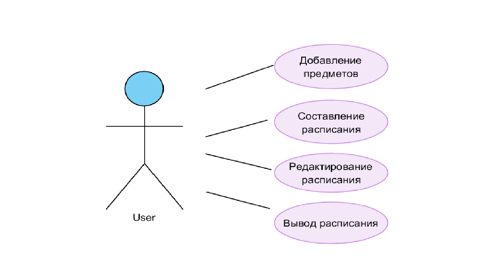

# Поток событий
---

# Содержание
1 [Актёры](#1)  
2 [Варианты использования](#2)  
2.1 [Добавление предметов](#2.1)  
2.2 [Составление расписания](#2.2)  
2.3 [Вывод расписания](#2.3)  
2.4 [Редактирование расписания](#2.4)  

<a name="1"/>

# 1 Актёры

| Актёр | Описание |
|:--|:--|
| Пользователь | Человек, использующий систему |

<a name="2"/>

# 2 Варианты использования

<a name="2.1"/>

## 2.1 Добавление предметов

**Описание.** Позволяет пользователю добавить предметы. 
**Основной поток.** 
1. Вариант использования начинается, когда пользователь запускает приложение;
2. Пользователь вносит список предметов;
3. Приложение проверяет "валидность" внесённых данных;
4. Если введённые данные "не валидны", то выполняется альтернативный поток А1;
5. Приложение сохраняет данные;
6. Вариант использования завершается;

**Альтернативный поток А1.**
1. Приложение просит ввести "валидные" данные;
2. Приложение указывает неккоректные данные;

<a name="2.2"/>

## 2.2 Составление расписания

**Описание.** Позволяет составить расписание.  
1. Вариант использования начинается, когда пользователь добавил предметы;
2. Приложение проверяет список внесённых предметов;
3. Приложение составляет расписание согласно алгоритму;
4. Вариант использования завершается;

<a name="2.3"/>

## 2.3 Вывод расписания

**Описание.** Позволяет пользователю просмотреть составленное расписание.   
1. Вариант использования начинается, когда приложение составило расписание;
2. Пользователь нажимает кнопку "Вывода расписания";
3. Приложение создаёт файл;
4. Приложение выполняет запись данных в созданный файл;
5. Вариант использования завершается;

<a name="2.4"/>

## 2.4 Редактирование расписания

**Описание.** Позволяет пользователю редактировать составленное расписание.  
1. Вариант использования начинается, когда приложение вывело расписание;
2. Пользователь редактирует, созданное приложением расписание;
3. Пользователь сохраняет данные в выбранное место;
4. Вариант использования завершается;

